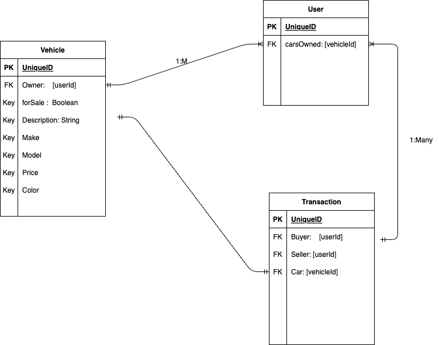
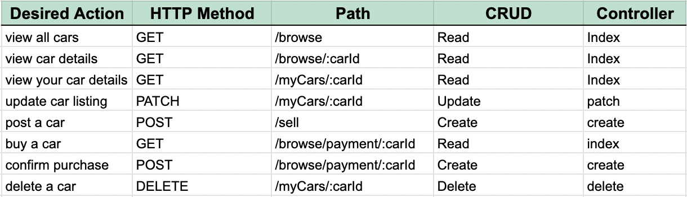
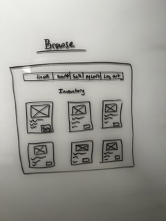
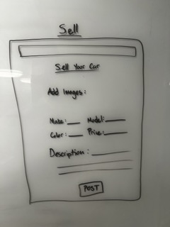
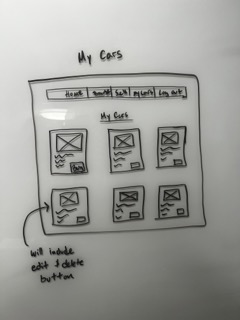

# PushStart
```
PushStart is a full-stack CRUD application that seamlessly connects car buyers & sellers.
```
## ERD


## RESTful Routing Chart



## Wireframes





## User Stories
```
* AAU, I want to be able to see the cars I own
* AAU, I want to be able to edit or delete the cars in my inventory
* AAU, I want to be able to browse through all the cars on the webpage
```
## Goals
### MVP Goals
```
* OAuth login
* Browse Inventory
* Add new listing
* Edit your listings
* Buy vehicles
* View your inventory
```

### Stretch Goals
```
* Favorite a vehicle
* Add messaging
* Filter through the inventory
```
